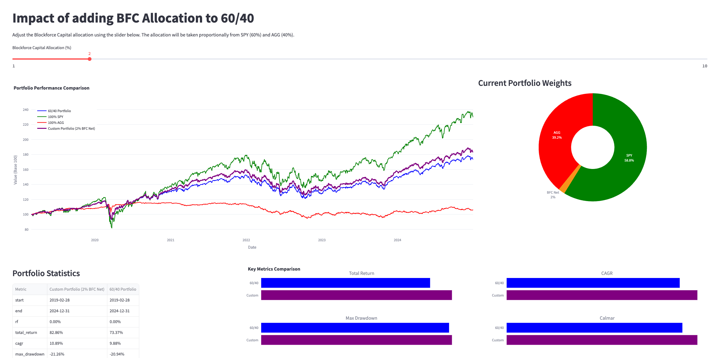

# Impact of Adding BFC Allocation to 60/40

[This Streamlit app](https://blockforce.streamlit.app/) allows you to interactively backtest a portfolio with dynamic allocation to the Blockforce Capital MultiStrat Fund (BFC Net), alongside traditional assets, In this case we are using the ETFs, SPY and AGG, as proxies for the stock and bond markets. You can compare your custom blend to classic benchmarks like 60/40, 100% SPY, and 100% AGG.

## Features

- **Interactive Slider:** Allocate 1–10% to Blockforce Capital (BFC Net), with the remainder split proportionally between SPY and AGG.
- **Performance Comparison:** Visualize the growth of $100 for your custom blend and benchmarks.
- **Current Portfolio Weights:** See a color-coded pie chart of your current allocation.
- **Portfolio Statistics:** View a detailed stats table for both your custom blend and the 60/40 benchmark.
- **Key Metrics Comparison:** Instantly compare key risk/return metrics (e.g., return, drawdown, Sharpe, best/worst month) with small-multiples bar charts.

## Example Screenshot



## How to Run

1. Install requirements:
   ```bash
   pip install -r requirements.txt
   ```
2. Launch the app:
   ```bash
   streamlit run app_bm_with_bfc.py
   ```
3. Open the provided local URL in your browser.

## Data

- **Blockforce Capital MultiStrat Fund**: Daily net returns are loaded from the provided CSV.
- **Benchmarks**: SPY and AGG prices are fetched via yfinance. 